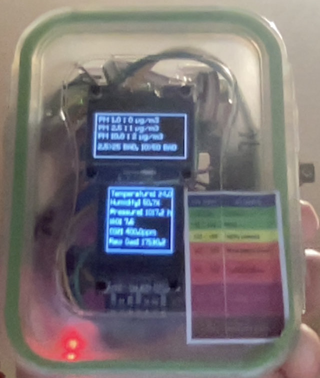
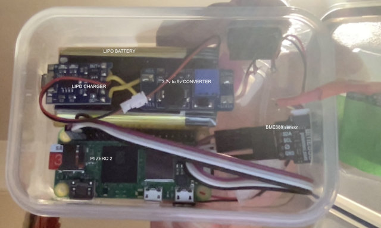

# BME688 Sensor App
Please follow the PI3G instructions here [PI3G Python module](https://github.com/pi3g/bme68x-python-library) for installing and testing the Python 3 library for the BME688 sensor and the native code library from BOSCH. I am assuming you have the pi3g examples working and know the I2C address of your sensor. 

The starting point is to install and run burn_in.py which after 24 hours will save a configuration file, that the other code will try to read. The readme.md file in the Burn-in directory provides more detail on the burn-in process, and reading the saved state.

There are two python files sensor_app_1-3-0.py and sensor_app_1-3-0-spi.py, the first uses an OLED with I2C interface as the display, and the second uses an OLED with SPI interface.  Both require editing to point to the correct burn-in config.

```
state_file_name = <your burn-in config file>
```
Here is an image of OLED displays showing data from pm25 and BME688 sensors in one box.



And below shows inside a smaller box with only the BME688 sensor (and not the pm25 sensor). These are low cost supermarket food boxes with snap on lids, that are easy to cut holes in.




I am using PI Zero 2 boards and the heat from board, the PM2.5 sensor, and the battery, can have a significant impact on the BME688 Bosch sensor.  The pi3g board has the sensor on a protruding nose of the board, keeping it away from the heat in the box. The Adafruit and Pimoroni BME688 boards have the sensor centrally mounted on a module making it more  difficult to mount in a box such that the sensor is kept away from the heat of the system.   There is a temperature offset parameter in the code to allow for this effect, but you must calibrate against an accurate source (for example a local METAR station).

To start the sensor-app code on boot of the Pi Zero the bme688-start.sh the script pm25-start.sh can be placed in /etc/init.d and then run the following to configure it:

```
$ sudo chmod +x /etc/init.d/bme688-start.sh
$ sudo update-rc.d bme688-start.sh defaults
```
Then to stop and start

```
$ sudo systemctl start bme-sensor-start
$ sudo systemctl stop bme-sensor-start
```

The code will log to /var/log/bme.log

Note: The startup script variable DAEMON assumes a path of /home/pi and you might need to change this as pi is no longer the default raspbian user. Also for the display to work a copy of the luma.examples fonts folder [luma.examples](https://github.com/rm-hull/luma.examples) is required. A copy of the font files only can be found in the PM25/fonts folder of this project. 