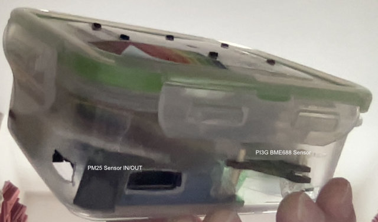
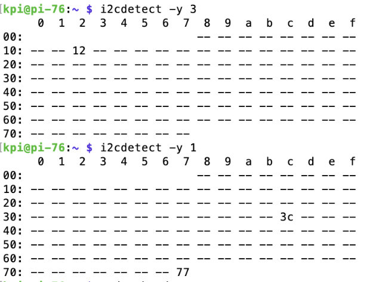
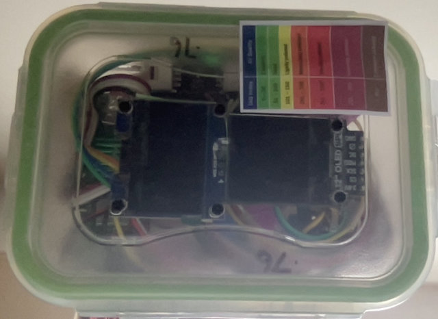

# Adafruit PMSA003I Air Quality Breakout - STEMMA QT 

I have two examples which both display on an OLED screen and one also logs results to a CSV file (pm25.py and pm25-nolog.py). 
Both are based on the Adafruit example code. 
The Adafruit product page is here:
[Adafruit product link](https://www.adafruit.com/product/4632)
And the github for the python code is here:
[Adafruit GitHub link](https://github.com/adafruit/Adafruit_CircuitPython_PM25)

This is a particulate sensor with an I2C interface and two STEMMA QT/Qwicc connections as well as a header.
It is the smallest PM25 sensor I have come across, with a fan intake and exhaust on one corner (90 degree offset). This means that if you push it into the corner of a case (with suitable holes cut for in/out) then one of the Qwicc connectors mounted either side of the board, will be blocked by the side of the case, but the other one should be accessible and the header on the end is available if you want to solder.



The I2C for the sensor runs at 100KHz which is slow, and therefore I run the PM2.5 sensor on a separate I2C Bus 3 running at the slower speed. Bus 3 and Bus 4 are supported on the Pi Zero 2 W that I use, and below shows how to enable Bus 3,

```
Edit /boot/config.txt and add the following line
dtoverlay=i2c-gpio,bus=3,i2c_gpio_sda=17,i2c_gpio_scl=27
That will use GPIO pins 17 and 27 for SDA and SCL and in addition you will need a 3.3v pin and GND pin.
```

This allows running other I2C sensors (BME688) on the standard I2C bus a lot faster.
To use I2C-3 the Adafruit Extended I2C library is required, in addition to the pm25 library.

```
pip3 install adafruit-extended-bus
pip3 install adafruit-circuitpython-pm25
```

Reboot and confirm you have both IC2 bus running.

```
i2c-detect -y 1  // Bus 1
i2c-detect -y 3   // Bus 3
```
My results below show the pm25 sensor on I2C Bus 3 at 0x12 and on the default I2C Bus 1 I have ox3C for the OLED display and 0x77 for the PI3G BME688 sensor. I have a second OLED display on SPI for the PM25 data as shown below.  



To display results on an OLED screen I use Luma and PIL.



```
apt-get install python3-pil
apt-get install libopenjp2-7
pip3 install luma-oled
```

To launch this code on boot the script pm25-start.sh can be placed in /etc/init.d and then run the following to configure it:
```
$ sudo chmod +x /etc/init.d/pm25-start.sh
$ sudo update-rc.d pm25-start.sh defaults
```
Then to stop and start 

```
$ sudo systemctl start pm-sensor-start
$ sudo systemctl stop pm-sensor-start
```
Note: The startup script variable DAEMON assumes a path of /home/pi and you might need to change this as pi is no longer the default raspbian user. Also for the display to work a copy of the luma.examples fonts folder is required, and the examples are separate from the luma-oled package. A copy of the fonts folder only is provided in this project under MP25/fonts, but I recommend luma.examples [luma.examples](https://github.com/rm-hull/luma.examples) as it is has a great set of examples as well as the fonts.  Your OLED display may require a different driver to mine, but that is a simple code change. 


